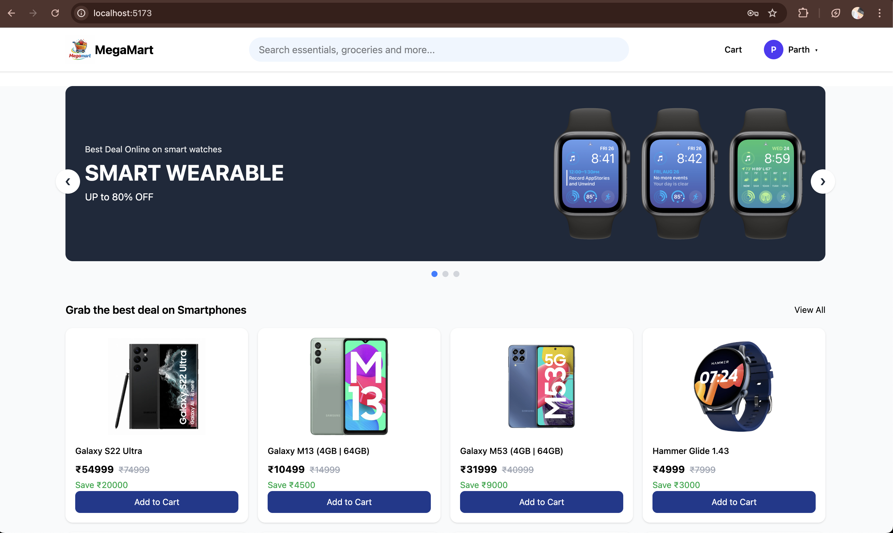

# 🛍️ Megamart – Modern E-Commerce Web App

Megamart is a modern, responsive e-commerce web application built using **React**, **Redux Toolkit**, and **Tailwind CSS**.  
It delivers a smooth shopping experience with real-time cart updates, product quantity synchronization, and a clean, scalable UI.

This project is designed following best practices and can be extended easily for real-world production use.

---

## ✨ Features

- 🏠 Product listing page
- 🔍 Product details page with live quantity control
- 🛒 Add to cart / remove from cart
- ➕➖ Quantity management synced across pages
- 🧮 Automatic price & total calculation
- 🔐 Authentication check before adding to cart
- 📱 Fully responsive UI (mobile-first)
- ⚡ Fast performance with Vite
- 🧼 Clean and maintainable code structure

---

## 📸 Screenshots

### Login Page

### 🏠 Home Page

### 📦 Product Details

### 🛒 Cart Page

### Profile

---

## 🛠️ Tech Stack

- **Frontend:** React + Vite  
- **Backend:** Node + MongoDb  
- **State Management:** Redux Toolkit  
- **Styling:** Tailwind CSS  
- **Routing:** React Router DOM  
- **Language:** JavaScript (ES6+)  

